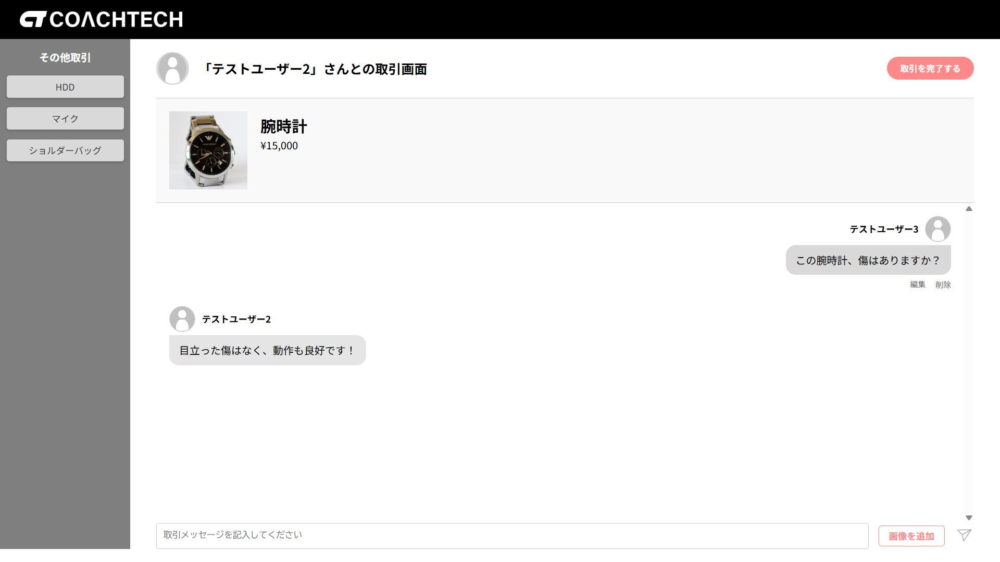
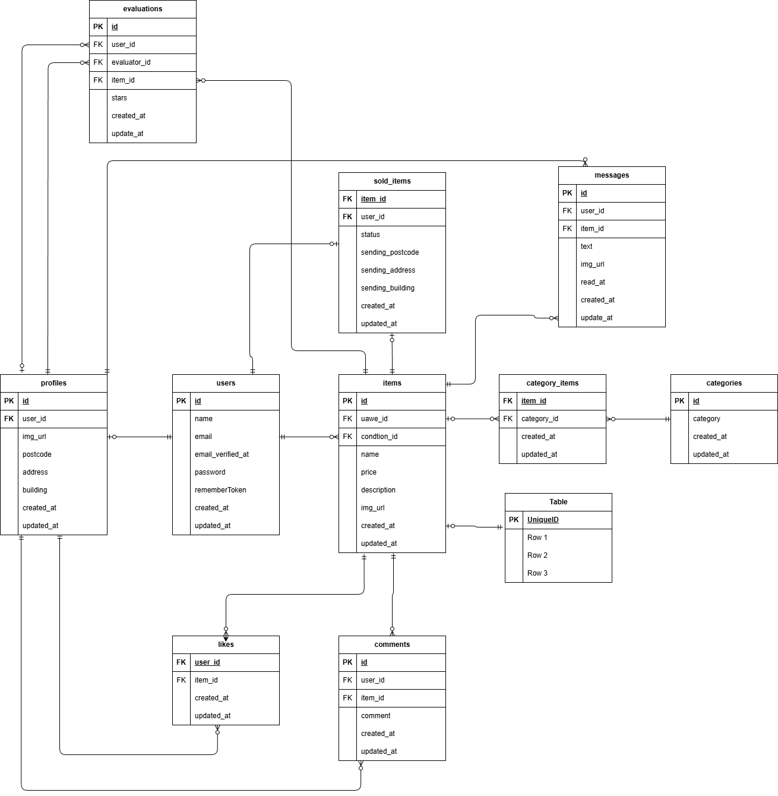

## 概要

　以前学習していたフリマアプリに、購入者と出品者間でチャットでのやり取りを行う機能と、それぞれの対応を評価し合う機能を追加しました。

## 環境構築

1. Gitでリンクをコピー、または下記に記載のURLをコピーした後、ターミナルでプロジェクトディレクトリを作成したら直下で以下のコマンドを実行してください。

```
git clone https://github.com/hosomitadasi/CoachtechPro-FleaMarket.git
```

2. Dockerを起動したら、プロジェクト直下で以下のコマンドを実行してください。

```
make init
```

## 作成画像

プロフィール画面


取引チャット画面


## 使用技術一覧

・laravel:8.83.27
・php:8.2.30
・nginx:1.21.1
・mysql:8.0.26
・

3．利用されているメールアプリとstripeのキーをdocker-compose.ymlと.envに追加してください。

## テーブル仕様

### usersテーブル

| カラム名          | 型           | primary key | unique key | not null | foreign key |
| ----------------- | ------------ | ----------- | ---------- | -------- | ----------- |
| id                | bigint       | ◯           |            | ◯        |             |
| name              | varchar(255) |             |            | ◯        |             |
| email             | varchar(255) |             | ◯          | ◯        |             |
| email_verified_at | timestamp    |             |            |          |             |
| password          | varchar(255) |             |            | ◯        |             |
| remember_token    | varchar(100) |             |            |          |             |
| created_at        | timestamp    |             |            |          |             |
| updated_at        | timestamp    |             |            |          |             |

### profilesテーブル

| カラム名   | 型           | primary key | unique key | not null | foreign key |
| ---------- | ------------ | ----------- | ---------- | -------- | ----------- |
| id         | bigint       | ◯           |            | ◯        |             |
| user_id    | bigint       |             |            | ◯        | users(id)   |
| img_url    | varchar(255) |             |            |          |             |
| postcode   | varchar(255) |             |            | ◯        |             |
| address    | varchar(255) |             |            | ◯        |             |
| building   | varchar(255) |             |            |          |             |
| created_at | timestamp    |             |            |          |             |
| updated_at | timestamp    |             |            |          |             |

### itemsテーブル

| カラム名     | 型           | primary key | unique key | not null | foreign key   |
| ------------ | ------------ | ----------- | ---------- | -------- | ------------- |
| id           | bigint       | ◯           |            | ◯        |               |
| user_id      | bigint       |             |            | ◯        | users(id)     |
| condition_id | bigint       |             |            | ◯        | condtions(id) |
| name         | varchar(255) |             |            | ◯        |               |
| price        | int          |             |            | ◯        |               |
| brand        | varchar(255) |             |            |          |               |
| description  | varchar(255) |             |            | ◯        |               |
| img_url      | varchar(255) |             |            | ◯        |               |
| created_at   | timestamp    |             |            |          |               |
| updated_at   | timestamp    |             |            |          |               |

### commentsテーブル

| カラム名   | 型           | primary key | unique key | not null | foreign key |
| ---------- | ------------ | ----------- | ---------- | -------- | ----------- |
| id         | bigint       | ◯           |            | ◯        |             |
| user_id    | bigint       |             |            | ◯        | users(id)   |
| item_id    | bigint       |             |            | ◯        | items(id)   |
| comment    | varchar(255) |             |            | ◯        |             |
| created_at | timestamp    |             |            |          |             |
| updated_at | timestamp    |             |            |          |             |

### likesテーブル

| カラム名   | 型        | primary key | unique key               | not null | foreign key |
| ---------- | --------- | ----------- | ------------------------ | -------- | ----------- |
| user_id    | bigint    |             | ◯(item_idとの組み合わせ) | ◯        | users(id)   |
| item_id    | bigint    |             | ◯(user_idとの組み合わせ) | ◯        | items(id)   |
| created_at | timestamp |             |                          |          |             |
| updated_at | timestamp |             |                          |          |             |

### sold_itemsテーブル

| カラム名         | 型           | primary key | unique key | not null | foreign key |
| ---------------- | ------------ | ----------- | ---------- | -------- | ----------- |
| item_id          | bigint       |             |            | ◯        | items(id)   |
| user_id          | bigint       |             |            | ◯        | users(id)   |
| status           | integer      |             |            | ◯        |             |
| sending_postcode | varchar(255) |             |            | ◯        |             |
| sending_address  | varchar(255) |             |            | ◯        |             |
| sending_building | varchar(255) |             |            |          |             |
| created_at       | created_at   |             |            |          |             |
| updated_at       | updated_at   |             |            |          |             |

### category_itemsテーブル

| カラム名    | 型        | primary key | unique key                   | not null | foreign key    |
| ----------- | --------- | ----------- | ---------------------------- | -------- | -------------- |
| item_id     | bigint    |             | ◯(category_idとの組み合わせ) | ◯        | items(id)      |
| category_id | bigint    |             | ◯(item_idとの組み合わせ)     | ◯        | categories(id) |
| created_at  | timestamp |             |                              |          |                |
| updated_at  | timestamp |             |                              |          |                |

### categoriesテーブル

| カラム名   | 型           | primary key | unique key | not null | foreign key |
| ---------- | ------------ | ----------- | ---------- | -------- | ----------- |
| id         | bigint       | ◯           |            | ◯        |             |
| category   | varchar(255) |             |            | ◯        |             |
| created_at | timestamp    |             |            |          |             |
| updated_at | timestamp    |             |            |          |             |

### conditionsテーブル

| カラム名   | 型           | primary key | unique key | not null | foreign key |
| ---------- | ------------ | ----------- | ---------- | -------- | ----------- |
| id         | bigint       | ◯           |            | ◯        |             |
| condition  | varchar(255) |             |            | ◯        |             |
| created_at | timestamp    |             |            |          |             |
| updated_at | timestamp    |             |            |          |             |

### messagesテーブル

| カラム名   | 型           | primary key | unique key | not null | foreign key |
| ---------- | ------------ | ----------- | ---------- | -------- | ----------- |
| id         | bigint       | ◯           |            | ◯        |             |
| user_id    | bigint       |             |            | ◯        | users(id)   |
| item_id    | bigint       |             |            | ◯        | items(id)   |
| text       | varchar(255) |             |            | ◯        |             |
| img_url    | varchar(255) |             |            |          |             |
| read_at    | timestamp    |             |            |          |             |
| created_at | timestamp    |             |            |          |             |
| updated_at | timestamp    |             |            |          |             |

### Evaluationsテーブル

| カラム名     | 型        | primary key | unique key | not null | foreign key |
| ------------ | --------- | ----------- | ---------- | -------- | ----------- |
| id           | bigint    | ◯           |            | ◯        |             |
| user_id      | bigint    |             |            | ◯        | users(id)   |
| evaluator_id | bigint    |             |            | ◯        | users(id)   |
| item_id      | bigint    |             |            | ◯        | items(id)   |
| stars        | integer   |             |            | ◯        |             |
| created_at   | timestamp |             |            |          |             |
| updated_at   | timestamp |             |            |          |             |

## ER図

取引チャット実装前


取引チャット実装後


## テストアカウント

name: テストユーザー1
email: user1@example.com
password: password

---

name: テストユーザー2
email: user2@example.com
password: password

---

name: テストユーザー3
email:user3@example.com
password:

---
